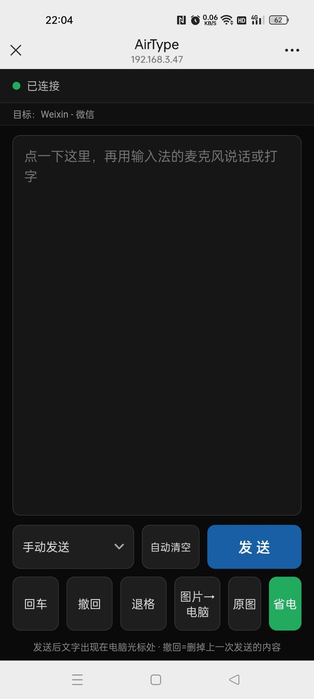

[English](README.en.md) | [简体中文](README.md)

# AirType — Cross-Screen Input

Type or dictate on your phone → text appears right at the cursor on your PC; snap a photo → it's pasted automatically into the input field your PC is focused on.
Pure LAN communication: **zero install on the phone** (any browser), **zero third-party dependencies on the PC**.


## Screenshots

| Phone input page | PC scan-to-connect page |
|:---:|:---:|
|  |  |


## Quick Start

### Windows

1. Double-click `build/AirType.exe` (requires the built-in .NET Framework 4.x; Win10/11 both satisfy this);
2. A "scan to connect" window pops up, and a tray icon stays resident in the bottom-right corner;
3. On your phone (same Wi-Fi as the PC), scan the QR code with WeChat / the system camera, or type the address shown in the window into the phone's browser;
4. When the phone page shows a green "Connected" dot, start typing.

Tray right-click menu: the first line always shows the current address / port / connection status; plus Open scan-connect page / Regenerate pairing code / Pause injection / Select network adapter (scan address) / Toggle startup on boot / View log / Open received-files folder / Recent files / Quit. Double-click the tray icon to reopen the scan page.

### Kylin (Kylin V10 and other Linux desktops)

```bash
bash kylin/install.sh        # one-click install: dependencies, desktop icon, autostart — zero input
python3 kylin/airtype.py     # or run directly, then open http://localhost:8765/pair in a browser
```

On first use you can run `python3 kylin/airtype.py --selfcheck` to check the injection channel; on multi-NIC machines where the phone can't connect, the startup log lists candidate addresses — restart with `--ip <address>` to switch NICs.

## The Phone Page

**Two input modes**

| Mode | Behavior | Best for |
|---|---|---|
| Manual send | Finish typing/speaking, tap **Send** | Short messages |
| Live sync | Text appears as you speak: a whole sentence is sent immediately, continuous input syncs at least every 0.4 s | Long dictation |

Auxiliary: **Enter** / **Backspace** / **Undo** (deletes the last sent content) / **Clear**; you can enable **Auto-clear** (clears after a 2.5 s pause, off by default).

**Photos → PC (both versions)**

Tap **Photo → PC** to multi-select from the gallery or take a shot on the spot:

- **Smart compression**: photos over 2 MB or with a long edge over 2048 px are compressed to JPEG; the **Original** toggle sends uncompressed (state is remembered);
- **Transfer**: shows "sending i/N · filename (percentage)"; tap the button again mid-upload to cancel the whole batch; a failed image is retried once automatically;
- Saved to `Downloads/AirType接收` (`~/Downloads`, or `~/下载` on Chinese-locale Kylin; duplicate names get an auto suffix; 200 MB per-file limit);
- The Windows version then pastes it into the app at the cursor (WeChat / Word / Notepad, etc.), putting both a file reference and a bitmap on the clipboard; pasting is asynchronous — the phone first shows "Saved", then the real result follows; if pasting fails, the target isn't an image, or pause-injection is on, it degrades to save-only and the file is never lost;
- On the PC: tray "Open received folder" / "Recent files", or the scan page's "Open received folder" button.

> Kylin's auto-paste depends on xclip / wl-copy and the target app's support — best-effort; saving to disk always works.

## Features

- **Text input**: Chinese / emoji from the phone IME straight to the PC cursor, manual or live-sync;
- **Pairing**: 4-digit code, randomized every startup; scan the QR or enter it manually;
- **PC-side control** (on the scan page, PC-local only): disconnect current phone, re-pair (new code + revoke old session), open received folder;
- **Status feedback**: green "Connected" dot on the phone; the scan page and the tray's first line show address:port and connection status live; both ends guide re-pairing after a code change;
- **Multi-NIC troubleshooting**: the QR points to a fixed "current scan address"; the Windows tray can switch NICs anytime (no restart), Kylin uses `--ip`;
- **Single session**: one phone at a time; a new connection replaces the old one with a notice;
- **Pause injection / autostart (both versions) / logs** (Windows `%LocalAppData%\AirType\log.txt`, Kylin `~/.config/airtype/log.txt`).

## How It Works

```
Phone browser (mobile.html)                PC
  │ text/keys → JSON text frames           ├─ Windows: AirType.exe (SendInput injection)
  ├─────────── WebSocket :8765 ────────────┤
  │ images → binary chunks (file protocol) └─ Kylin: airtype.py (xdotool/dotool/clipboard)
```

- **Zero dependencies**: the Windows version is a single C# 5 source file compiled with the system `csc.exe`, with web pages and the icon embedded into the exe; the Kylin version uses only the Python 3 standard library; the WebSocket is a hand-written RFC6455 (with fragment reassembly, compatible with WeChat's in-app browser).
- **Injection**: Windows uses `SendInput` character-by-character without touching the clipboard; Kylin auto-selects a channel per session (X11: clipboard > xdotool > dotool; Wayland: dotool > clipboard > xdotool), reporting failures back to the phone.
- **Undo guardrail**: the PC tracks "characters actually injected into the current foreground window this session" (reset on window switch); batch backspace is truncated when it exceeds the quota, so unrelated apps' text is never deleted.
- **Security**: data never leaves the LAN or passes through any server; the 4-digit code prevents accidental connections; filenames are sanitized and writes are restricted to the receive directory; frame/file sizes are capped; the scan page and QR resources are PC-local (other LAN devices get 403).

## Building from Source

**Windows**: run `build\build_stage1.bat` (system `csc.exe`, .NET Framework 4.x); output is `build\AirType.exe`. Three hard constraints: (1) C# 5 syntax only (not even string interpolation); (2) the source must stay UTF-8 with BOM, or Chinese strings garble; (3) `src/web/` pages and `src/airtype.ico` are embedded resources — recompile after editing, and quit the running instance first (file lock).

**Kylin**: no compilation — run `python3 kylin/airtype.py`; pages live under `kylin/web/`, so just refresh the browser.

## Directory Layout

```
src/     Windows version: AirType.cs (single file) + airtype.ico + web/ (phone/scan-page resources)
kylin/   Kylin version: airtype.py + web/ + install.sh / run.sh + assets/
build/   build_stage1.bat and the output AirType.exe
screenshots/  App screenshots (phone input page / PC scan page)
```

## FAQ

**Phone can't connect / times out after scanning?**
1. Is the phone on the **same Wi-Fi** as the PC (mobile data never works)?
2. On multi-NIC PCs (VPN / hotspot / virtual adapters), the QR may point to a NIC the phone can't reach: check the current address on the scan page and try another (Windows tray "Select NIC", Kylin `--ip` then restart);
3. Windows Firewall blocking inbound? As admin PowerShell:
   ```powershell
   New-NetFirewallRule -Name AirType8765 -DisplayName "AirType LAN input (TCP 8765)" -Direction Inbound -Protocol TCP -LocalPort 8765 -Action Allow -Profile Any
   ```
   Note: **Block rules take precedence over Allow** — if you clicked "Cancel" on a past allow prompt, the system created a block rule; delete it for the allow to work;
4. Still stuck: switch the PC's network profile from "Public" to "Private".

**Pairing code changed and the phone can't connect?** A new code is issued every startup, so old codes/pages are invalid. The phone page shows a code-entry box — just type the new 4-digit code on the PC screen; no re-scan needed.

**Photo transferred but not pasted?** Pasting only goes to the window that is foreground at the moment the transfer completes — don't switch windows right after sending. If the target doesn't accept clipboard file references, or pause-injection is on, it degrades to save-only — grab the file from `Downloads/AirType接收`.

**Phone shows "Injection failed"?** The PC-side injection channel has a problem (common on Kylin: permissions, session switching). Check the PC log; run `--selfcheck` on Kylin, or `--test-inject` for a live test.

**Can multiple phones be used at once?** No — one session at a time; a new device replaces the old one.

## Known Limitations

- Input into the PC only; no reverse (PC → phone) and no clipboard sync;
- Live sync uses a longest-common-prefix incremental algorithm; after large out-of-order edits on the phone, the phone's content wins;
- In terminal windows clipboard paste is Ctrl+Shift+V, which the Kylin clipboard channel is insensitive to (the typing channel is fine);
- The Windows scan popup uses the system WebBrowser control (IE11 engine), so page code must stay ES5.

## Acknowledgments

**AirType** is a secondary development built on **TypeBridge**, an open-source project by the WeChat public account **「赛博Teacher李」** ([gitee.com/lanyacp/TypeBridge](https://gitee.com/lanyacp/TypeBridge)).

Huge thanks to the original author for open-sourcing it and for the inspiration — standing on his shoulders, I was able to add UX optimizations and feature enhancements for Windows and Kylin. Respect to the author; follow his account 「赛博Teacher李」 for more original tools.

## License

[MIT](LICENSE)
